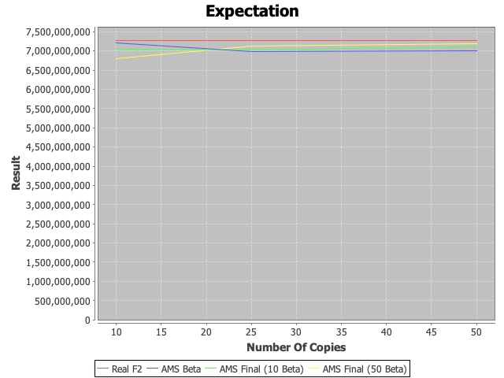

<div>

# AMS

This repository contains code to experiment with the different AMS algorithms **Alpha, Beta and Final**.

Each experiment gets a [Stream](https://docs.oracle.com/javase/8/docs/api/java/util/stream/Stream.html) of the [Harry Potter](src/main/resources/hp.txt) Book!
* _1,170,484_ words in total
* _69,686_ distinct words
* F2 is _7,262,951,972_

Java was chosen to get a reasonable running time, using high parallelism.

[Getting started](#getting-started) •
[Results](#results) 

</div>

## Getting started
```sh
git clone https://github.com/michaldeutch/AMS.git

cd AMS/

mvn clean install
```

## Results

### AMS Alpha

```sh
# Re-run test
mvn -Dtest=AMSTest#testAlpha test
...
******* Finished processing ams.AMSBase, params=[]
Used Mem=1
Expectation=5888724497
Normalized Variance=14404619
```

### AMS Beta & Final

```sh
# Re-run test
mvn -Dtest=AMSTest#testBetaFinalVersion test

# 3 files should be generated, but it could take a few hours :)
# Expectation.jpeg, Normalized-Variance (Absolute).jpeg, Used Memory.jpeg
```

I chose to create 3 charts - one for each measure, and display all 3 serieses of experiments:
1. **Beta estimator** - with _10, 25, 50_ Alpha estimators
2. **Final estimator with _10_ Beta Estimators** - with _10, 25, 50_ Alpha estimators
3. **Final estimator with _50_ Beta Estimators** - with _10, 25, 50_ Alpha estimators

#### Relative Errors

To get a 99% success rate, we will take  &delta; = 0.01


##### Beta Estimators:

From class we know that Pr[|B-F<sub>2</sub>| > &epsilon;F<sub>2</sub>] < 2/k&epsilon;<sup>2</sup> ~ &delta; , then we can infer &epsilon;.

* For 10 Alpha estimators we get that &epsilon; = 4.47
* For 25 Alpha estimators we get that &epsilon; = 2.82
* For 50 Alpha estimators we get that &epsilon; = 2

Which is not a good approximation

##### Final Estimators:

In order for the median to be off accuracy, more than half of the beta estimators should be off. 
So we get that Pr[|Final-F<sub>2</sub>| > &epsilon;F<sub>2</sub>] < (2/k&epsilon;<sup>2</sup>)<sup>b/2</sup> ~ &delta;
When b is the number of used Beta estimators

* For 10 Beta estimators, b/2=5
  * For 10 Alpha estimators we get that &epsilon; = 0.71
  * For 25 Alpha estimators we get that &epsilon; = 0.45
  * For 50 Alpha estimators we get that &epsilon; = 0.32
* For 50 Beta estimators, b/2=25
  * For 10 Alpha estimators we get that &epsilon; = 0.49
  * For 25 Alpha estimators we get that &epsilon; = 0.31
  * For 50 Alpha estimators we get that &epsilon; = 0.22
#### Expectation Chart



It's notable that all of the estimators are pretty close to the real F2 - due to **unbiased** quality

#### Normalized Variance Chart

Absolute value was applied to each of the normalized variance values

.jpeg)

It's obvious that the Beta estimator is much less accurate then the final estimators. Both of the final estimators look pretty close together in this scale.

#### Memory Usage
Calculated is the number of total basic estimators used.


